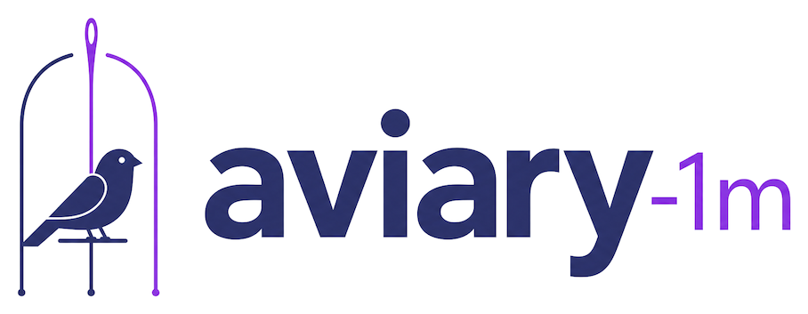
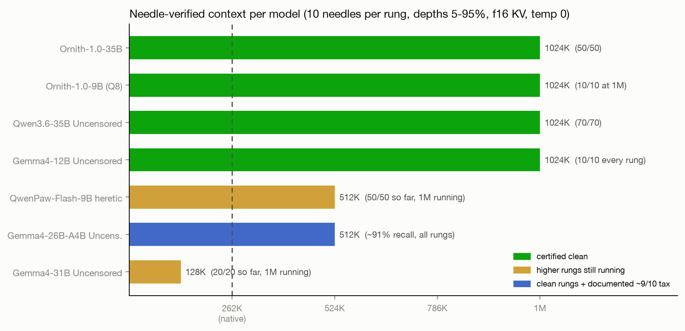
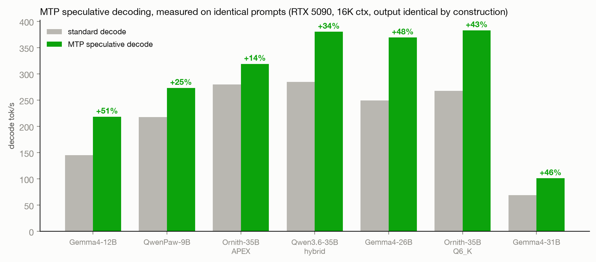

<div align="center">



**A flock of open models extended to a 1,048,576-token context with YaRN, then certified needle by needle. Plus MTP speculative-decoding grafts, vision hookups, and the full test harness that proves every claim.**

[](https://opensource.org/licenses/MIT)
[]()
[]()
[]()
[]()

</div>

## What this is

Take a strong open model. Bake YaRN rope-scaling metadata into its GGUF so llama.cpp and Ollama run it at 1M context with no flags. Prove the extension works with a multi-needle retrieval harness at every length, no skipped rungs, and publish the raw results next to the weights. Where the model family ships a multi-token-prediction layer, graft it back for 25 to 51 percent faster decoding with identical output. Where a vision tower exists, wire it up and verify it. Ship only what passed.

No fine-tuning anywhere: every trunk is bit-identical to its source release apart from rope metadata (and, where noted, an appended MTP layer from the family's official checkpoint).

## The fleet





| Model | Params | Uncensored | 1M needle status | MTP | Vision | Get it |
|---|---|---|---|---|---|---|
| **Qwen3.6-35B Uncensored** | 35B MoE (3B active) | yes | **70/70, certified to 1M** | baked in, +34% | verified | [HF](https://huggingface.co/satgeze/Qwen3.6-35B-Uncensored-HauhauCS-1M-GGUF) · [MS](https://www.modelscope.ai/models/satgeze/Qwen3.6-35B-Uncensored-HauhauCS-1M-GGUF) |
| **Ornith-1.0-35B** | 35B MoE (3B active) | no | **50/50, certified to 1M** | baked in, +43% (Q6_K) / +14% (APEX 17GB) | verified | [HF](https://huggingface.co/satgeze/Ornith-1.0-35B-1M-GGUF) · [MS](https://www.modelscope.ai/models/satgeze/Ornith-1.0-35B-1M-GGUF) |
| **Gemma4-12B Uncensored** | 12B dense | yes | **10/10 every rung to 1M, on a 32GB card** | separate head, +51% | verified | [HF](https://huggingface.co/satgeze/Gemma4-12B-Uncensored-HauhauCS-1M-GGUF) · [MS](https://www.modelscope.ai/models/satgeze/Gemma4-12B-Uncensored-HauhauCS-1M-GGUF) |
| **Gemma4-12B Uncensored 1.5M** | 12B dense | yes | **10/10 certified to 1.31M on a 32GB card**; 2M study closed; RULER next | separate head, +51% | verified | [HF](https://huggingface.co/satgeze/Gemma4-12B-Uncensored-HauhauCS-1.5M-GGUF) · [MS](https://www.modelscope.ai/models/satgeze/Gemma4-12B-Uncensored-HauhauCS-1.5M-GGUF) · [Ollama](https://ollama.com/satgeze/gemma4-12b-uncensored-1.5m) |
| **Ornith-1.0-9B** | 9B dense | no | 10/10 at 1M (Q8+f16 KV); budget config mapped | baked in, up to +38% | verified | [HF](https://huggingface.co/satgeze/Ornith-1.0-9B-1M-GGUF) · [MS](https://www.modelscope.ai/models/satgeze/Ornith-1.0-9B-1M-GGUF) |
| **QwenPaw-Flash-9B heretic** | 9B dense | yes | 50/50 to 524K, 1M rungs running | baked in, +25% | verified | publishing after final rungs |
| **Gemma4-26B-A4B Uncensored** | 26B MoE (4B active) | yes | ~91% recall, honestly documented | separate head, +48% | verified | [HF](https://huggingface.co/satgeze/Gemma4-26B-A4B-Uncensored-HauhauCS-1M-GGUF) · [MS](https://www.modelscope.ai/models/satgeze/Gemma4-26B-A4B-Uncensored-HauhauCS-1M-GGUF) |
| **Gemma4-31B Uncensored** | 31B dense | yes | 20/20 to 131K, higher rungs running | separate head, +46% | verified | [HF](https://huggingface.co/satgeze/Gemma4-31B-Uncensored-HauhauCS-1M-GGUF) · [MS](https://www.modelscope.ai/models/satgeze/Gemma4-31B-Uncensored-HauhauCS-1M-GGUF) |
| **Ornith-1.0-397B** | 397B MoE | no | pod session pending | extraction possible (official layer exists) | TBD | [MS (full)](https://www.modelscope.ai/models/satgeze/Ornith-1.0-397B-1M-GGUF) · [HF (pointer)](https://huggingface.co/satgeze/Ornith-1.0-397B-1M-GGUF) |

Collections: [Ornith 1M Context](https://huggingface.co/collections/satgeze/ornith-1m-context-6a499d6fe2ff4ace90d85201) · [Uncensored 1M Context](https://huggingface.co/collections/satgeze/uncensored-1m-context-gemma-4-qwen36-6a4b33493b132e3da13b2c29) · [Beyond 1M Context](https://huggingface.co/collections/satgeze/beyond-1m-context-6a4bb9a0a2718d4c312515ae)

Hugging Face repos carry the MTP-first picks; the complete quant ladders live permanently on the ModelScope mirrors (same repo names). Every model card ships its own heatmap, speed chart, and raw `results.jsonl`, including the imperfect runs.

## How it works

1. **1M context**: `tools/bake_yarn.py` writes YaRN rope-scaling metadata (factor 4.0 over native 262,144) into the GGUF header. No weight changes. Works on Qwen3.5, Qwen3.6, and Gemma 4 family GGUFs.
2. **Certification**: `niah_test.py` plants 10 needles at depths 5 to 95 percent, temperature 0, seeded haystacks, against any OpenAI-compatible server. Certification runs use f16 KV only; quantized-KV numbers are always labeled as budget configs. Full ladders, no skipped rungs, misses published.
3. **MTP**: Qwen3.5/3.6 ship a multi-token-prediction layer in official checkpoints that finetunes usually drop. Where a community build restored it we vetted and re-baked it; for Qwen3.6 we grafted the layer ourselves at the GGUF tensor level (see the model card). Gemma 4 heads ship as separate 250MB draft files. The trunk verifies every drafted token, so speculative decoding never changes output.
4. **Vision**: mmproj towers attach at runtime via `--mmproj`. Each one smoke-tested on the exact published trunk (image text transcription plus object identification).

## Contents

| File | Purpose |
|---|---|
| `niah_test.py` | Multi-needle haystack test against any OpenAI-compatible endpoint |
| `tools/bake_yarn.py` | Bake YaRN 1M metadata into any supported GGUF |
| `tools/smoke_gate.py` | Coherence gate: catches repetition-collapse before anything ships |
| `make_charts*.py` | Render heatmaps and speed charts from results |
| `pipelines/*.sh` | Quant ladder pipelines: download, bake, quantize, verify, upload |
| `results*.jsonl` | Raw benchmark data |

## Quick start

The flagship, everything on (llama.cpp):

```bash
llama-server -m qwen3.6-35b-uncensored-1M-MTP-Q4_K_M.gguf \
  -c 1048576 -np 1 --jinja \
  --spec-type draft-mtp --spec-draft-n-max 3 \
  --mmproj mmproj-qwen36-hauhau-f16.gguf
```

Ollama (1M and vision work; MTP speedup needs llama.cpp until Ollama ships speculative decoding):

```
FROM ./qwen3.6-35b-uncensored-1M-MTP-Q4_K_M.gguf
RENDERER qwen3.5
PARSER qwen3.5
PARAMETER num_ctx 262144
```

Memory rule of thumb at 1M f16 KV: hybrid-attention families keep it small. Ornith-35B ~20GB KV, Ornith-9B ~32GB, Gemma 4 smaller still thanks to 5:1 sliding-window layers (the 12B certifies at 1M inside a 32GB GPU).

## Studies

[Beyond 1M: how far YaRN stretches before it bends](docs/beyond-1m-study.md), a factor 6 vs 8 ladder study to 2M on one RTX 5090. Found the certified frontier (1.31M clean), the factor tax, and the 2M bend.

## Credits

Model training: [DeepReinforce](https://huggingface.co/deepreinforce-ai) (Ornith-1.0, MIT), [Qwen](https://huggingface.co/Qwen), [Google](https://huggingface.co/google) (Gemma 4 QAT), [agentscope-ai](https://huggingface.co/agentscope-ai) (QwenPaw). Uncensoring: [HauhauCS](https://huggingface.co/HauhauCS), [SC117](https://huggingface.co/SC117) (heretic). MTP packaging: [Unsloth](https://huggingface.co/unsloth), protoLabsAI, wang-yang, SC117. Context extension, grafts, certification, and publishing: [SatGeze](https://huggingface.co/satgeze). MIT, same as the tooling deserves.
