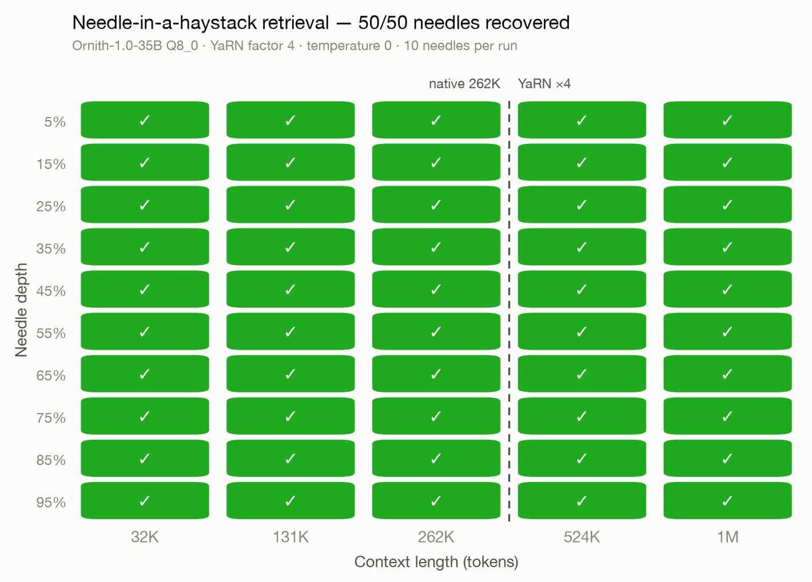
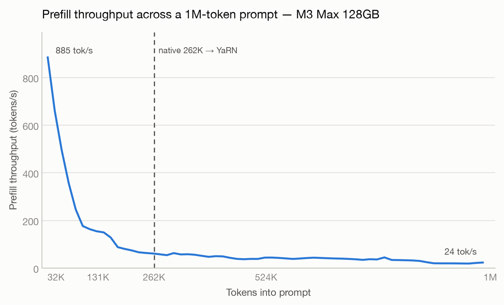

<div align="center">

# Ornith 1M Context

**Extending [Ornith-1.0](https://huggingface.co/deepreinforce-ai/Ornith-1.0-35B) from 262K to 1,048,576-token context with YaRN — validated needle-perfect, no fine-tuning.**

[](https://huggingface.co/satgeze/Ornith-1.0-35B-1M-GGUF)
[-ffd21e?logo=huggingface)](https://huggingface.co/satgeze/Ornith-1.0-9B-1M-GGUF)
[](https://opensource.org/licenses/MIT)
[]()
[]()
[]()
[]()

</div>

## What this is

Ornith-1.0 models are Qwen3.5-family hybrids: only ~1 in 4 layers is full attention (the rest linear attention), so the KV cache at 1M tokens is ~20 GB (35B) / ~32 GB (9B) instead of hundreds of GB. That makes million-token context practical on consumer hardware — this repo holds the tooling and evidence; the ready-to-run GGUFs live on Hugging Face with the YaRN rope-scaling metadata baked in, so llama.cpp and Ollama apply the 4× extension automatically.

## Results

10 needles per run at depths 5–95%, single pass, temperature 0 — perfect retrieval at every length through 1M, replicated with independent haystacks:



| Context | Needles | Cold prefill (M3 Max 128GB) |
|---|---|---|
| 32,768 | 10/10 | 38 s |
| 131,072 | 10/10 | 8.3 min |
| 262,144 (native) | 10/10 | 23 min |
| 524,288 (YaRN 2×) | 10/10 | 97 min |
| 1,048,576 (YaRN 4×) | 10/10 | ~6.8 h |



## Contents

| File | Purpose |
|---|---|
| `niah_test.py` | Multi-needle haystack test against any OpenAI-compatible endpoint |
| `bake_yarn.py` | Bake YaRN 1M metadata into any Qwen3.5-family GGUF |
| `make_charts.py` | Render the heatmap + throughput charts from results |
| `ornith9b_quants_pipeline.sh` | Full 9B quant ladder: download → bake → imatrix low-bit quants → upload |
| `results.jsonl`, `prefill_timing.jsonl` | Raw benchmark data |

## Model repos

- **35B (MoE, 3B active):** [satgeze/Ornith-1.0-35B-1M-GGUF](https://huggingface.co/satgeze/Ornith-1.0-35B-1M-GGUF) — IQ1_S through BF16, all 1M-baked
- **9B (dense):** [satgeze/Ornith-1.0-9B-1M-GGUF](https://huggingface.co/satgeze/Ornith-1.0-9B-1M-GGUF) — same ladder, building now

## Quick start

```bash
ollama run hf.co/satgeze/Ornith-1.0-35B-1M-GGUF:Q4_K_M
# then: /set parameter num_ctx 1048576   (needs ~20GB free for KV)
```

or llama.cpp, no flags needed beyond context size:

```bash
llama-server -m ornith-1.0-35b-1M-Q8_0.gguf -c 1048576 -np 1 --jinja
```

## Credits

All model training credit to [DeepReinforce](https://huggingface.co/deepreinforce-ai) (Ornith-1.0, MIT). This project only changes rope-scaling metadata and measures the result. MIT, same as upstream.
