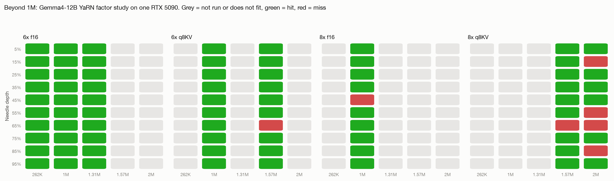

# Beyond 1M: how far YaRN stretches before it bends

A one-night study (July 6-7, 2026) answering a question from a Discord thread: if YaRN can take a 262K model to 1M, can it go further? Short answer: yes to 1.31M cleanly, to 1.57M with one dropped needle, and 2M is where retrieval visibly bends. All on a single RTX 5090 (32GB), all data published.

## Setup

- Model: Gemma4-12B QAT Uncensored (HauhauCS trunk), chosen because Gemma's 5:1 sliding-window attention keeps KV small enough that beyond-1M contexts fit consumer hardware
- Two bakes from the same trunk: YaRN factor 6 (max 1,572,864 tokens) and factor 8 (max 2,097,152)
- Harness: 10 needles per rung at depths 5 to 95 percent, temperature 0, seeded haystacks ([niah_test.py](../niah_test.py))
- Two KV tiers: f16 (certification grade) and q8_0 (budget grade, clearly labeled), because f16 KV stops fitting 32GB around 1.5M

## Results

| Config | 262K | 1M | 1.31M | 1.57M | 2M |
|---|---|---|---|---|---|
| 6x, f16 KV | 10/10 | 10/10 | **10/10** | does not fit 32GB | n/a (6x max is 1.57M) |
| 8x, f16 KV | not run | 9/10 | not run | does not fit 32GB | does not fit 32GB |
| 6x, q8 KV | not run | 10/10 | not run | 9/10 | n/a |
| 8x, q8 KV | not run | not run | not run | 9/10 | **6/10** |

"Not run" cells were skipped deliberately: each config only tested the cells other configs could not answer, to spend GPU-hours on new information.

## Findings

1. **1,310,720 tokens, needle-perfect, on a 32GB consumer card.** The longest clean needle certification we know of at f16 KV. This became the shipped [Gemma4-12B-Uncensored-1.5M](https://huggingface.co/satgeze/Gemma4-12B-Uncensored-HauhauCS-1.5M-GGUF) build.
2. **The YaRN factor itself costs quality.** Same model, same 1M rung: factor 6 scores 10/10, factor 8 scores 9/10. Interpolating rope frequencies across a wider range blurs positional geometry even below the new maximum. Rule: bake the smallest factor that reaches your target length.
3. **q8 KV extends reach at a measurable, small price.** It halves cache memory (fitting 1.57M+ into 32GB) and cost roughly one needle at the 1.5M-class rungs. A fair trade when labeled honestly; never a substitute for f16 certification.
4. **2M is where it bends: 6/10, degradation spread across depths** (15/55/65/85 percent), not a positional cliff and not a collapse. The model still finds most facts in a two-million-token haystack, which is remarkable, but 60 percent retrieval fails our shipping bar.

## Decision

The factor-6 build shipped (certified tier 1.31M, budget tier 1.57M documented). The factor-8 build stays unshipped: we publish the data instead of the model. The 2M line of work is closed for these trunks; a certifiable 2M most likely requires a longer-native-context base, per-dimension scaling variants, or brief fine-tuning at the target length, none of which this study attempted.

Next tier of scrutiny for the shipped builds: NVIDIA's RULER benchmark (multikey NIAH, variable tracking, aggregation), results to be published on the model cards, sample counts stated.

## Raw data

Per-needle records for all four ladders ship with the 1.5M model repo (`results-*.jsonl`): [Hugging Face](https://huggingface.co/satgeze/Gemma4-12B-Uncensored-HauhauCS-1.5M-GGUF) | [ModelScope](https://www.modelscope.ai/models/satgeze/Gemma4-12B-Uncensored-HauhauCS-1.5M-GGUF)
